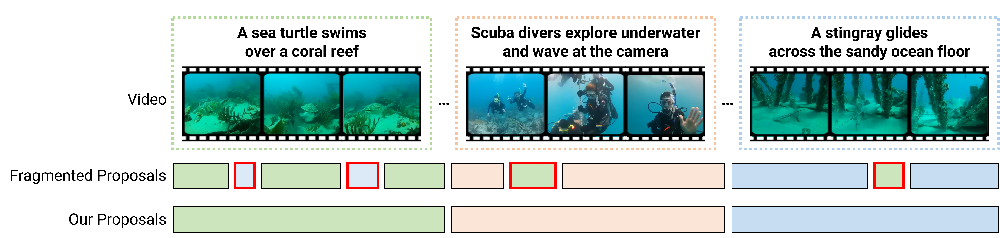
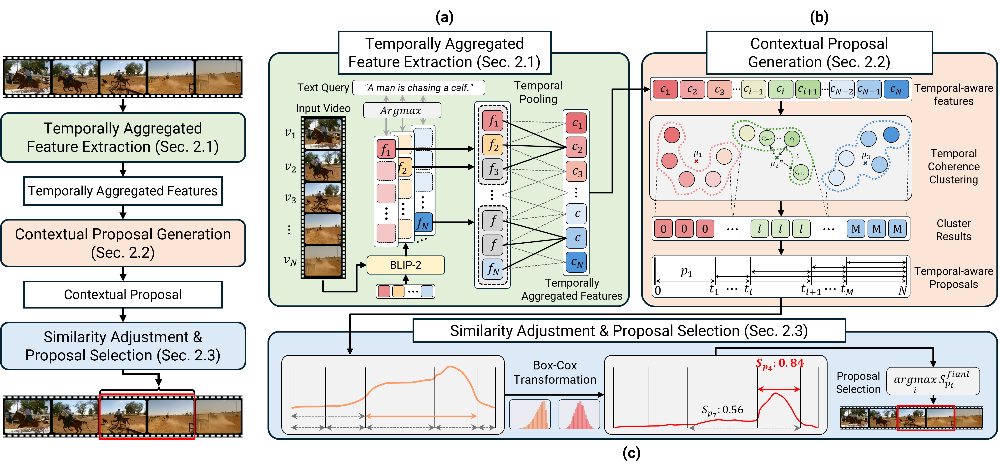

# TAG: A Simple Yet Effective Temporal-Aware Approach for Zero-Shot Video Temporal Grounding
This repository contains the implementation of our BMVC 2025 paper, 
["TAG: A Simple Yet Effective Temporal-Aware Approach for Zero-Shot Video Temporal Grounding"](https://arxiv.org/pdf/2508.07925).

TAG is a simple yet effective temporal-aware framework for zero-shot Video Temporal Grounding (VTG).  
By leveraging temporal pooling, temporal coherence clustering, and similarity adjustment, TAG captures contextual continuity in videos and mitigates **segment fragmentation**, where semantically consistent frames are mistakenly split across multiple segments.  
This enables accurate localization of target moments without any training or reliance on large language models.  
TAG achieves state-of-the-art performance on Charades-STA and ActivityNet Captions, demonstrating strong generalization and robustness across various settings.
## Method Overview

<div align="center">
  
</div>

## Pipeline

<div align="center">
  
</div>


## Quick Start

### Requiments
- python=3.8
- pytorch==2.0.1
- torchvision==0.15.2
- pytorch-cuda=11.7
- torchaudio==2.0.2
- tqdm
- scikit-learn
- ipykernel
- seaborn
- statsmodels
- patsy
- salesforce-lavis


## Data Preparation

Before training or evaluation, please prepare the datasets and extract visual features as follows.

### 1. Download Datasets

#### Charades-STA
- Download the Charades video dataset from the [Charades Project Page](https://prior.allenai.org/projects/charades).
- Extract the videos into your desired directory, e.g.: `videos/Charades/`


#### ActivityNet Captions
- Visit the [ActivityNet Download Page](http://activity-net.org/download.html) and request access to the dataset.
- Once approved, download the video dataset from ActivityNet.
- Extract the videos into your desired directory, e.g.: `videos/ActivityNet/`


### 2. Extract Visual Features

We use the BLIP-2 image-text matching model (pretrained on COCO) to extract visual features at **3 FPS**.

For Charades-STA:
```bash
python feature_extraction.py \
  --input_root videos/Charades/ \
  --save_root datasets/Charades/
```

For ActivityNet:
```bash
python feature_extraction.py \
  --input_root videos/ActivityNet/ \
  --save_root datasets/ActivityNet/
```

## Main Results

### Standard Split

```bash
# Charades-STA dataset
python evaluate.py --dataset charades --llm_output dataset/charades-sta/llm_outputs.json --tckmeans

# ActivityNet dataset
python evaluate.py --dataset activitynet --llm_output dataset/activitynet/llm_outputs.json --tckmeans
```

| Dataset        | IoU=0.3 | IoU=0.5 | IoU=0.7 |  mIoU   |
| :-----         | :-----: | :-----: | :-----: | :-----: |
|  Charades-STA  |  67.82  |  48.58  |  26.67  |  45.69  |
|  ActivityNet   |  51.88  |  28.91  |  15.07  |  36.55  |

### Frequency-Domain Extensions (Optional)

You can enable the frequency-domain enhancements described in the report via CLI overrides:

- **FFT similarity smoothing**: `--fft_smoothing --fft_cutoff 0.25`
- **Adaptive FFT cutoff**: `--fft_adaptive --fft_energy_ratio 0.9`
- **FFT band mixing (low/high fusion)**: `--fft_band_mix --fft_low_weight 0.7 --fft_high_weight 0.3`
- **Spectral whitening**: `--spectral_whitening --spectral_whitening_strength 0.5`
- **Frequency regularization**: `--freq_regularization --freq_reg_strength 0.5`
- **Wavelet multi-scale pooling**: `--wavelet_levels 1`
- **Frequency attention**: `--freq_attention --freq_attention_mode channel --freq_attention_strength 1.0`
- **Octave temporal convolution**: `--octave_conv --octave_alpha 0.5 --octave_kernel_size 3`
- **Mask threshold override**: `--score_threshold 0.2`

### Implemented Improvements Summary

The following frequency-domain improvements are implemented in this repo for further tuning:

1. **FFT similarity smoothing** to reduce high-frequency noise in frame-text similarity.
2. **Adaptive FFT cutoff** using an energy ratio to retain dominant spectral components automatically.
3. **FFT band mixing** to blend low-frequency trend with high-frequency boundaries.
4. **Spectral whitening** to flatten dominant spectral peaks and emphasize discriminative changes.
5. **Frequency-domain regularization** via soft attenuation of higher frequencies.
6. **Wavelet multiscale pooling** to capture coarse trends and fine detail jointly.
7. **Frequency attention** to reweight informative spectral channels or bands.
8. **Octave-style temporal convolution** to model low/high temporal frequencies efficiently.


### OOD Splits

```bash
# Charades-STA OOD-1
python evaluate.py --dataset charades --split OOD-1 --tckmeans

# Charades-STA OOD-2
python evaluate.py --dataset charades --split OOD-2 --tckmeans

# ActivityNet OOD-1
python evaluate.py --dataset activitynet --split OOD-1 --tckmeans

# ActivityNet OOD-2
python evaluate.py --dataset activitynet --split OOD-2 --tckmeans
```

| Dataset              | IoU=0.3 | IoU=0.5 | IoU=0.7 |  mIoU   |
| :-----               | :-----: | :-----: | :-----: | :-----: |
|  Charades-STA OOD-1  |  68.25  |  45.27  |  23.20  |  44.71  |
|  Charades-STA OOD-2  |  68.31  |  44.11  |  21.99  |  44.62  |
|  ActivityNet OOD-1   |  51.42  |  28.52  |  14.68  |  36.19  |
|  ActivityNet OOD-2   |  51.23  |  28.34  |  14.54  |  36.05  |


```bash
# Charades-CD test-ood
python evaluate.py --dataset charades --split test-ood --tckmeans

# Charades-CG novel-composition
python evaluate.py --dataset charades --split novel-composition --tckmeans

# Charades-CG novel-word
python evaluate.py --dataset charades --split novel-word --tckmeans
```

| Dataset                           | IoU=0.3 | IoU=0.5 | IoU=0.7 |  mIoU   |
| :-----                            | :-----: | :-----: | :-----: | :-----: |
|  Charades-STA test-ood            |  68.09  |  49.45  |  26.58  |  45.97  |
|  Charades-STA novel-composition   |  64.38  |  43.55  |  21.30  |  41.95  |
|  Charades-STA novel-word          |  68.49  |  52.37  |  32.66  |  47.86  |


## Acknowledgement

This repository is built upon the official implementation of [TFVTG (ECCV 2024)](https://github.com/minghangz/TFVTG). We thank the authors for their valuable contributions and open-source code.
